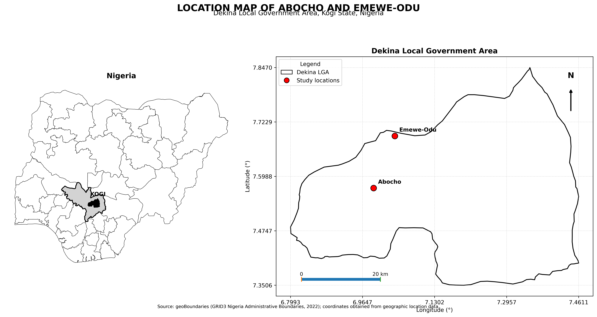

# GIS Location Mapping — Abocho & Emewe-Odu

### Dekina Local Government Area • Kogi State • Nigeria


---

## 🗺️ Project Overview

This project presents a professional GIS location mapping workflow for **Abocho** and **Emewe-Odu**, two locations within **Dekina Local Government Area, Kogi State, Nigeria**.

The project demonstrates how geographic coordinates and administrative boundary datasets can be combined to produce a clear, publication-ready location map.

The workflow was developed using **Python, GeoPandas and Matplotlib**, with emphasis on coordinate reference systems, spatial visualization and cartographic presentation.

---

## 📍 Study Area

**Country:** Nigeria  
**State:** Kogi State  
**Local Government Area:** Dekina LGA  
**Locations:** Abocho and Emewe-Odu

### Geographic Coordinates

| Location | Latitude | Longitude |
|---|---:|---:|
| Abocho | 7.572112 | 6.990155 |
| Emewe-Odu | 7.690878 | 7.038968 |

---

## 🖼️ Final Map



> The final map provides a multi-level geographic context from Nigeria and Kogi State to Dekina LGA and the two mapped locations.

---

## 🎯 Project Objectives

- Map the geographic locations of Abocho and Emewe-Odu.
- Identify their position within Dekina Local Government Area.
- Provide state and national geographic context.
- Demonstrate the use of geographic coordinates in GIS mapping.
- Apply appropriate coordinate reference systems for spatial visualization.
- Produce a professional, high-resolution cartographic output.

---

## 🛠️ Tools & Technologies

| Tool | Purpose |
|---|---|
| Python | Geospatial data processing |
| GeoPandas | Spatial data manipulation |
| Matplotlib | Map visualization |
| Jupyter Notebook | Interactive analysis |
| geoBoundaries | Administrative boundary data |
| UTM / EPSG:32632 | Projected coordinate system |

---

## 🔄 Workflow

```text
Geographic Data
       ↓
Administrative Boundaries
       ↓
Coordinate Collection
       ↓
Coordinate Transformation
       ↓
Spatial Processing
       ↓
Cartographic Design
       ↓
High-Resolution Map Export